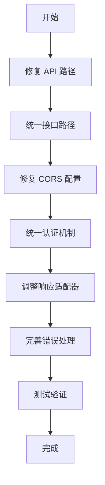

# 前后端对接可行性分析报告

## 1. 执行摘要

本报告对 `apps/hl8-admin`（前端）与 `apps/fastify-api`（后端）的对接可行性进行全面分析。经过技术栈兼容性、API 接口对接、数据格式匹配、认证机制、安全性等多维度评估，**整体可行性为：中等偏高（7/10）**。

### 核心结论

✅ **可行**：技术栈兼容、架构设计合理、有适配器层处理数据转换  
⚠️ **需要调整**：API 路径不匹配、接口命名不一致、响应格式需适配  
❌ **风险点**：Cookie 认证机制需要协调、CORS 配置需完善

---

## 2. 技术栈兼容性分析

### 2.1 语言与类型系统

| 维度     | 前端 (hl8-admin)       | 后端 (fastify-api) | 兼容性               |
| -------- | ---------------------- | ------------------ | -------------------- |
| 编程语言 | TypeScript 5.9.3       | TypeScript 5.x     | ✅ 完全兼容          |
| 类型系统 | 严格模式               | 严格模式           | ✅ 完全兼容          |
| 模块系统 | ESM (`type: "module"`) | CommonJS (NestJS)  | ✅ HTTP 通信，无影响 |

**评估**：✅ 完全兼容，类型系统一致，可通过共享类型定义实现类型安全。

### 2.2 框架与运行时

| 维度        | 前端               | 后端                  | 兼容性             |
| ----------- | ------------------ | --------------------- | ------------------ |
| 核心框架    | React 19 + Vite    | NestJS 11 + Fastify   | ✅ 完全兼容        |
| HTTP 客户端 | Axios 1.13.2       | Fastify 5.6.2         | ✅ 标准 HTTP，兼容 |
| 数据验证    | Zod 4.1.12         | class-validator + Zod | ✅ 兼容            |
| 日志系统    | console.log (开发) | Pino (生产级)         | ⚠️ 建议统一        |

**评估**：✅ 框架层面完全兼容，HTTP 通信标准，无技术障碍。

---

## 3. API 接口对接分析

### 3.1 API 路径配置

#### 后端配置

```typescript
// apps/fastify-api/src/main.ts
app.setGlobalPrefix('api/v1')
// 实际路径：/api/v1/auth/login
```

#### 前端配置

```typescript
// apps/hl8-admin/src/lib/api-client.ts
baseURL: import.meta.env.VITE_API_BASE_URL || 'http://localhost:9528/v1'
// 实际调用：http://localhost:9528/v1/auth/login
```

**问题**：❌ **路径不匹配**

- 后端实际路径：`/api/v1/auth/login`
- 前端调用路径：`/v1/auth/login`
- **缺少 `/api` 前缀**

**解决方案**：

```typescript
// 方案 1：修改前端 baseURL
baseURL: import.meta.env.VITE_API_BASE_URL || 'http://localhost:9528/api/v1'

// 方案 2：修改后端全局前缀（不推荐，影响其他客户端）
app.setGlobalPrefix('v1')
```

**优先级**：🔴 **高** - 必须修复，否则所有 API 调用将失败。

### 3.2 接口路径映射

| 功能         | 后端路径             | 前端调用路径              | 状态      |
| ------------ | -------------------- | ------------------------- | --------- |
| 用户注册     | `POST /auth/signup`  | `POST /auth/register`     | ❌ 不匹配 |
| 用户登录     | `POST /auth/login`   | `POST /auth/login`        | ✅ 匹配   |
| 刷新令牌     | `POST /auth/refresh` | `POST /auth/refreshToken` | ❌ 不匹配 |
| 用户登出     | `POST /auth/logout`  | `POST /auth/sign-out`     | ❌ 不匹配 |
| 获取用户信息 | `GET /auth/me`       | `GET /users/profile`      | ❌ 不匹配 |

**问题分析**：

1. **注册接口**：`signup` vs `register` - 语义相同，需统一
2. **刷新令牌**：`refresh` vs `refreshToken` - 需统一
3. **登出接口**：`logout` vs `sign-out` - 需统一
4. **用户信息**：`/auth/me` vs `/users/profile` - 后端有两个接口，需确认使用哪个

**解决方案**：

```typescript
// 方案 1：修改前端服务层（推荐）
// apps/hl8-admin/src/lib/services/auth.service.ts
async register() {
  return apiClient.post('/auth/signup', data)  // 改为 signup
}

async refreshToken() {
  return apiClient.post('/auth/refresh', data)  // 改为 refresh
}

async signOut() {
  return apiClient.post('/auth/logout', data)  // 改为 logout
}

// 方案 2：修改后端路由（不推荐，影响 API 一致性）
```

**优先级**：🔴 **高** - 必须修复，否则认证流程无法正常工作。

### 3.3 请求参数格式

#### 登录请求

**后端期望**：

```typescript
// apps/fastify-api/src/modules/auth/dtos/login.dto.ts
{
  identifier: string // 邮箱或用户名
  password: string
}
```

**前端发送**：

```typescript
// apps/hl8-admin/src/lib/services/auth.service.ts
interface SignInRequest {
  identifier: string
  password: string
}
```

**评估**：✅ **完全匹配**

#### 刷新令牌请求

**后端期望**：

```typescript
// 从 Cookie 读取 refreshToken，无需请求体
// 使用 RefreshTokenGuard 验证
```

**前端发送**：

```typescript
// apps/hl8-admin/src/lib/services/auth.service.ts
interface RefreshTokenRequest {
  refreshToken: string // 通过请求体发送
}
```

**问题**：⚠️ **机制不一致**

- 后端：从 Cookie 读取 `refreshToken`
- 前端：通过请求体发送 `refreshToken`

**解决方案**：

```typescript
// 方案 1：修改前端，使用 Cookie（推荐）
// 后端已设置 HttpOnly Cookie，前端无需手动发送
// 只需调用 POST /auth/refresh，后端自动从 Cookie 读取

// 方案 2：修改后端，支持请求体（不推荐，降低安全性）
```

**优先级**：🟡 **中** - 需要协调，但不影响基本功能。

---

## 4. 响应数据格式分析

### 4.1 后端响应格式

```typescript
// apps/fastify-api/src/common/interfaces/api-response.interface.ts
interface ApiResponse<T> {
  success: boolean;
  data?: T;
  error?: ApiError;
  meta?: ApiMeta;
}

// 成功响应示例
{
  success: true,
  data: { ... },
  meta: {
    correlationId: "...",
    timestamp: "2024-01-01T00:00:00.000Z"
  }
}

// 错误响应示例
{
  success: false,
  error: {
    message: "错误消息",
    code: "ERROR_CODE",
    details: { ... }
  },
  meta: {
    correlationId: "..."
  }
}
```

### 4.2 前端期望格式

```typescript
// apps/hl8-admin/src/lib/api-client.ts
// 响应拦截器提取 data 字段
if (response.data && 'data' in response.data) {
  return {
    ...response,
    data: response.data.data,  // 提取 data 字段
  }
}

// 前端服务层期望
interface SignInResponse {
  message: string;
  data: SignInResponseData;
  tokens: { ... };
}
```

### 4.3 格式适配分析

**问题**：⚠️ **格式不完全匹配**

1. **成功响应**：
   - 后端：`{ success: true, data: T, meta: {...} }`
   - 前端期望：`{ message: string, data: T }` 或 `{ code, message, data }`
   - **前端适配器已处理**：提取 `data` 字段 ✅

2. **错误响应**：
   - 后端：`{ success: false, error: { message, code, details } }`
   - 前端处理：通过 `handle-server-error.ts` 统一处理 ✅

3. **登录响应特殊处理**：

   ```typescript
   // 后端实际返回（auth.controller.ts）
   {
     user: { ... },
     accessToken: "...",
     refreshToken: "..."
   }

   // 但会被 ResponseInterceptor 包装为
   {
     success: true,
     data: {
       user: { ... },
       accessToken: "...",
       refreshToken: "..."
     },
     meta: { ... }
   }
   ```

   **前端适配器需要调整**：

   ```typescript
   // apps/hl8-admin/src/lib/adapters/auth.adapter.ts
   // 需要适配新的响应格式
   ```

**评估**：🟡 **需要调整适配器层**

**解决方案**：

1. 更新前端适配器，适配后端统一响应格式
2. 或修改后端响应拦截器，对认证接口特殊处理（不推荐）

**优先级**：🟡 **中** - 有适配器层，调整成本较低。

---

## 5. 认证机制分析

### 5.1 Token 存储机制

#### 后端实现

```typescript
// apps/fastify-api/src/modules/auth/auth.controller.ts
// 登录成功后设置 HttpOnly Cookie
reply.setCookie(
  COOKIE_CONFIG.ACCESS_TOKEN.name,
  data.accessToken,
  COOKIE_CONFIG.ACCESS_TOKEN.options  // HttpOnly, Secure, SameSite
);
reply.setCookie(
  COOKIE_CONFIG.REFRESH_TOKEN.name,
  data.refreshToken,
  COOKIE_CONFIG.REFRESH_TOKEN.options
);

// 同时返回响应体（用于前端显示）
return {
  user: data.user,
  accessToken: data.accessToken,
  refreshToken: data.refreshToken,
};
```

#### 前端实现

```typescript
// apps/hl8-admin/src/stores/auth-store.ts
// 从 Cookie 读取 Token
function getTokenFromCookie(key: string): string {
  const token = getCookie(key)
  return token || ''
}

// 保存 Token 到 Cookie
function setTokenToCookie(key: string, token: string): void {
  setCookie(key, token, 60 * 60 * 24 * 7)
}
```

**问题分析**：

1. **后端使用 HttpOnly Cookie**：JavaScript 无法直接读取
2. **前端手动管理 Cookie**：与后端机制冲突
3. **Token 来源不一致**：后端从 Cookie 读取，前端从响应体获取

**评估**：❌ **机制冲突**

**解决方案**：

```typescript
// 方案 1：统一使用 Cookie（推荐）
// 后端：继续使用 HttpOnly Cookie
// 前端：移除手动 Cookie 管理，依赖后端自动处理
// 修改 api-client.ts，启用 withCredentials
apiClient.defaults.withCredentials = true

// 方案 2：统一使用响应体（不推荐，降低安全性）
// 后端：移除 Cookie 设置，只返回响应体
// 前端：继续手动管理 Cookie
```

**优先级**：🔴 **高** - 认证机制是核心功能，必须统一。

### 5.2 Token 刷新机制

#### 后端实现

```typescript
// apps/fastify-api/src/modules/auth/auth.controller.ts
@Post('/refresh')
@UseGuards(RefreshTokenGuard)  // 从 Cookie 读取 refreshToken
async refreshToken(@GetUser('sub') userId: string, ...) {
  const rt = req.cookies[COOKIE_CONFIG.REFRESH_TOKEN.name];
  // 刷新逻辑...
  reply.setCookie(ACCESS_TOKEN.name, accessToken, ...);
  reply.setCookie(REFRESH_TOKEN.name, refreshToken, ...);
  return { message: 'Tokens refreshed successfully' };
}
```

#### 前端实现

```typescript
// apps/hl8-admin/src/lib/api-client.ts
// 响应拦截器处理 401 错误
if (error.response?.status === 401) {
  // 调用刷新令牌 API
  const response = await authService.refreshToken({
    refreshToken: refreshToken,  // 从状态中获取
  });
  // 更新 Token
  authState.setTokens({ ... });
  // 重试原始请求
  return apiClient(originalRequest);
}
```

**问题**：⚠️ **刷新机制不匹配**

- 后端：从 Cookie 自动读取，无需请求体
- 前端：通过请求体发送 refreshToken

**解决方案**：

```typescript
// 修改前端刷新逻辑
async refreshToken(): Promise<RefreshTokenResponse> {
  // 无需请求体，后端自动从 Cookie 读取
  const response = await apiClient.post<RefreshTokenResponse>(
    '/auth/refresh',
    {},  // 空请求体
    { skipDataExtraction: true }
  );
  // 后端已设置新 Cookie，前端只需更新状态
  return response.data;
}
```

**优先级**：🟡 **中** - 需要调整，但不影响基本功能。

---

## 6. CORS 配置分析

### 6.1 后端配置

```typescript
// apps/fastify-api/src/main.ts
app.enableCors({
  origin: corsOrigins, // 从环境变量读取
  credentials: true, // 允许携带凭证（Cookie）
})
```

### 6.2 前端配置

```typescript
// apps/hl8-admin/src/lib/api-client.ts
const apiClient = axios.create({
  baseURL: '...',
  withCredentials: false, // ❌ 暂时禁用
  // ...
})
```

**问题**：❌ **CORS 配置不匹配**

- 后端：允许携带凭证（`credentials: true`）
- 前端：禁用凭证（`withCredentials: false`）
- **结果**：Cookie 无法正常传输

**解决方案**：

```typescript
// 修改前端配置
const apiClient = axios.create({
  baseURL: import.meta.env.VITE_API_BASE_URL || 'http://localhost:9528/api/v1',
  withCredentials: true, // ✅ 启用凭证
  // ...
})
```

**环境变量配置**：

```env
# 后端 .env
CORS_ORIGIN=http://localhost:5173,http://localhost:3000

# 前端 .env
VITE_API_BASE_URL=http://localhost:9528/api/v1
```

**优先级**：🔴 **高** - 必须修复，否则 Cookie 认证无法工作。

---

## 7. 错误处理分析

### 7.1 后端错误处理

```typescript
// apps/fastify-api/src/common/filters/http-exception.filter.ts
// 统一错误响应格式
{
  success: false,
  error: {
    message: "错误消息",
    code: "ERROR_CODE",
    details: { ... }
  },
  meta: {
    correlationId: "..."
  }
}
```

### 7.2 前端错误处理

```typescript
// apps/hl8-admin/src/lib/handle-server-error.ts
// 统一处理服务器错误
export function handleServerError(error: AxiosError) {
  if (error.response) {
    const errorData = error.response.data
    // 处理错误消息
  }
}
```

**评估**：✅ **基本兼容**

- 前端有统一的错误处理机制
- 需要适配后端新的错误格式（`error.code`, `error.details`）

**优先级**：🟢 **低** - 已有错误处理，只需微调。

---

## 8. 数据验证分析

### 8.1 后端验证

```typescript
// apps/fastify-api
// 使用 class-validator + Zod
@Post('/login')
async login(@Body() loginDto: LoginDto) {
  // ValidationPipe 自动验证
}
```

### 8.2 前端验证

```typescript
// apps/hl8-admin
// 使用 Zod + React Hook Form
const schema = z.object({
  identifier: z.string().email(),
  password: z.string().min(8),
})
```

**评估**：✅ **完全兼容**

- 前后端都使用 Zod，可以共享 Schema 定义
- 前端验证可以防止无效请求，提升用户体验

**优先级**：🟢 **低** - 已实现，无需调整。

---

## 9. 风险评估

### 9.1 高风险项

| 风险项              | 影响  | 概率 | 缓解措施                    |
| ------------------- | ----- | ---- | --------------------------- |
| API 路径不匹配      | 🔴 高 | 100% | 修改前端 baseURL 或后端前缀 |
| 接口路径不一致      | 🔴 高 | 100% | 统一接口命名规范            |
| Cookie 认证机制冲突 | 🔴 高 | 100% | 统一使用 HttpOnly Cookie    |
| CORS 配置错误       | 🔴 高 | 100% | 启用 withCredentials        |

### 9.2 中风险项

| 风险项               | 影响  | 概率 | 缓解措施     |
| -------------------- | ----- | ---- | ------------ |
| 响应格式不匹配       | 🟡 中 | 80%  | 调整适配器层 |
| Token 刷新机制不一致 | 🟡 中 | 80%  | 统一刷新逻辑 |
| 错误格式适配         | 🟡 中 | 60%  | 更新错误处理 |

### 9.3 低风险项

| 风险项         | 影响  | 概率 | 缓解措施        |
| -------------- | ----- | ---- | --------------- |
| 数据验证差异   | 🟢 低 | 30%  | 共享 Zod Schema |
| 日志系统不一致 | 🟢 低 | 50%  | 统一日志格式    |

---

## 10. 实施建议

### 10.1 优先级排序

#### 第一阶段：核心修复（必须完成）

1. ✅ 修复 API 路径配置
   - 修改前端 `baseURL` 为 `http://localhost:9528/api/v1`
   - 或修改后端全局前缀（不推荐）

2. ✅ 统一接口路径
   - 修改前端服务层：`register` → `signup`
   - 修改前端服务层：`refreshToken` → `refresh`
   - 修改前端服务层：`sign-out` → `logout`

3. ✅ 修复 CORS 配置
   - 前端启用 `withCredentials: true`
   - 后端配置正确的 `CORS_ORIGIN`

4. ✅ 统一认证机制
   - 移除前端手动 Cookie 管理
   - 依赖后端 HttpOnly Cookie
   - 更新 Token 刷新逻辑

#### 第二阶段：适配优化（建议完成）

5. ⚠️ 调整响应格式适配器
   - 更新 `auth.adapter.ts` 适配新格式
   - 更新其他适配器（如需要）

6. ⚠️ 完善错误处理
   - 适配后端错误格式（`error.code`, `error.details`）
   - 更新错误消息显示

#### 第三阶段：优化增强（可选）

7. 🔵 共享类型定义
   - 创建共享类型包（`@hl8/types`）
   - 前后端共享接口定义

8. 🔵 统一日志系统
   - 前端引入日志库（如 `pino`）
   - 统一日志格式

### 10.2 实施步骤



### 10.3 测试验证清单

- [ ] API 路径正确，所有请求能到达后端
- [ ] 登录功能正常，Token 正确存储
- [ ] Token 刷新机制正常工作
- [ ] 登出功能正常，Cookie 正确清除
- [ ] 错误响应正确显示
- [ ] CORS 配置正确，无跨域问题
- [ ] 认证守卫正常工作，未授权请求被拦截

---

## 11. 结论

### 11.1 可行性评估

**总体可行性：7/10（中等偏高）**

| 维度         | 评分  | 说明                   |
| ------------ | ----- | ---------------------- |
| 技术栈兼容性 | 10/10 | 完全兼容，无技术障碍   |
| API 接口对接 | 6/10  | 路径不匹配，需调整     |
| 数据格式匹配 | 7/10  | 有适配器层，需微调     |
| 认证机制     | 5/10  | 机制冲突，需统一       |
| 安全性       | 8/10  | 后端安全配置完善       |
| 可维护性     | 8/10  | 代码结构清晰，注释完整 |

### 11.2 最终建议

✅ **建议实施**，但需要完成以下修复：

1. **必须修复**（阻塞性问题）：
   - API 路径配置
   - 接口路径统一
   - CORS 配置
   - 认证机制统一

2. **建议修复**（影响体验）：
   - 响应格式适配
   - 错误处理完善

3. **可选优化**（提升质量）：
   - 共享类型定义
   - 统一日志系统

### 11.3 预计工作量

- **核心修复**：2-3 个工作日
- **适配优化**：1-2 个工作日
- **测试验证**：1 个工作日
- **总计**：4-6 个工作日

### 11.4 风险提示

⚠️ **主要风险**：

1. Cookie 认证机制需要前后端协调，可能影响现有功能
2. 响应格式变化可能影响其他依赖该格式的代码
3. 接口路径修改需要全面测试，确保无遗漏

✅ **风险可控**：

- 有适配器层，调整成本较低
- 代码结构清晰，修改影响范围可控
- 有完整的错误处理机制

---

## 12. 附录

### 12.1 相关文件清单

**前端关键文件**：

- `apps/hl8-admin/src/lib/api-client.ts` - API 客户端配置
- `apps/hl8-admin/src/lib/services/auth.service.ts` - 认证服务
- `apps/hl8-admin/src/lib/adapters/auth.adapter.ts` - 认证适配器
- `apps/hl8-admin/src/stores/auth-store.ts` - 认证状态管理

**后端关键文件**：

- `apps/fastify-api/src/main.ts` - 应用启动配置
- `apps/fastify-api/src/modules/auth/auth.controller.ts` - 认证控制器
- `apps/fastify-api/src/common/interceptors/response.interceptor.ts` - 响应拦截器
- `apps/fastify-api/src/common/filters/http-exception.filter.ts` - 异常过滤器

### 12.2 环境变量配置示例

**后端 `.env`**：

```env
PORT=9528
CORS_ORIGIN=http://localhost:5173,http://localhost:3000
ACCESS_TOKEN_SECRET=your-secret-min-10-chars
REFRESH_TOKEN_SECRET=your-secret-min-10-chars
ACCESS_TOKEN_EXPIRATION=15m
REFRESH_TOKEN_EXPIRATION=7d
```

**前端 `.env`**：

```env
VITE_API_BASE_URL=http://localhost:9528/api/v1
```

### 12.3 参考文档

- [NestJS 文档](https://docs.nestjs.com/)
- [Fastify 文档](https://www.fastify.io/)
- [TanStack Query 文档](https://tanstack.com/query/latest)
- [Axios 文档](https://axios-http.com/)

---

**报告版本**：1.0.0  
**生成时间**：2024年  
**分析人员**：AI Assistant  
**审核状态**：待审核
